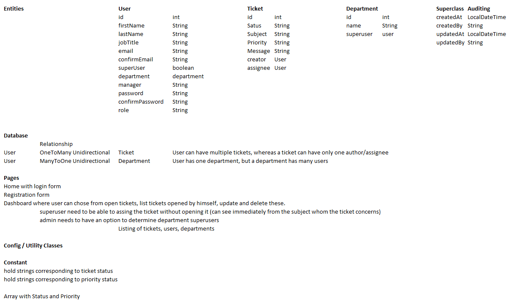
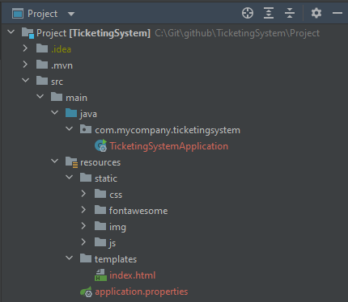
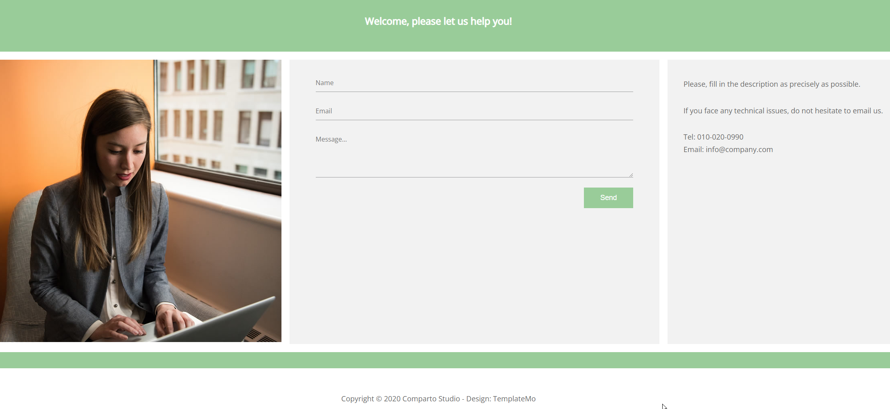
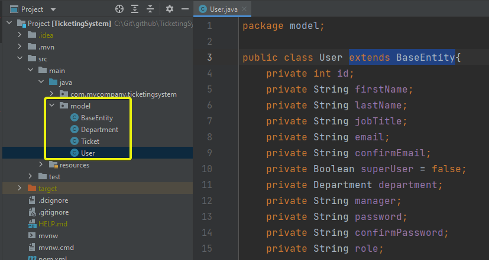

# 1. Make a brief plan of the Entities, Tables and how these will interact:



# 2. Download a free HTML Template

I picked one from this website: https://templatemo.com/

# 3. Create SpringBoot Project with following dependencies

```
<dependency>
    <groupId>org.springframework.boot</groupId>
    <artifactId>spring-boot-starter-thymeleaf</artifactId>
</dependency>
<dependency>
    <groupId>org.springframework.boot</groupId>
    <artifactId>spring-boot-starter-web</artifactId>
</dependency>
<dependency>
    <groupId>org.springframework.boot</groupId>
    <artifactId>spring-boot-devtools</artifactId>
    <scope>runtime</scope>
    <optional>true</optional>
</dependency>
```

- **Thymeleaf** is a modern server-side Java template engine.
- **Spring MVC** provides us an embedded TomCat server as well as support to use the MVC design pattern.
- **Devtools** allow us to improve development time. I use it to make an automatic build on save.

# 4. application.properties

```
spring.thymeleaf.cache=false
spring.thymeleaf.prefix=file:src/main/resources/templates/
```

- We are disabling thymeleaf template caching, which will provide us a new page everytime we refresh the page on the browser. Without it, we need to refresh it several times before having a non-cached version.

# 5. Move the free HTML template into the project



# 6. Make the eventual adaptions that you think necessary

- Our page can now be accessed from http://localhost:8080/ ans looks like this:
  

# 7. I'll create the required entities as per the initial plan


