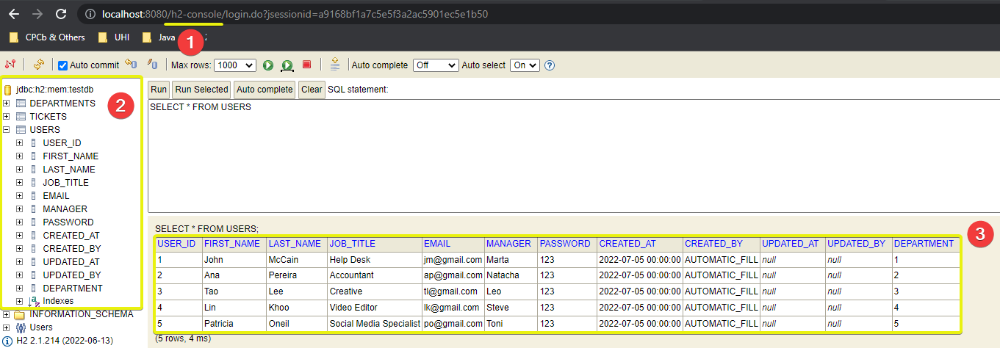

# 1. Create the DB Tables

Learning from the past, I now start by creating the tables and inserting some dummy data. This allows me to make a quick check if the fields and their organization make sense.

We are going to use an **H2**, in-memory DB that's good for PoC. This DB will be deleted and re-created everytime we stop/start the server.
We'll have two additional files: **schema.sql** and **data.sql** that have the schema structure and the dummy data needed. This files will be used at startup to create and populate our DB.

## 1.1. Add necessary dependencies

```
<dependency>
    <groupId>org.springframework.boot</groupId>
    <artifactId>spring-boot-starter-jdbc</artifactId>
</dependency>

<dependency>
    <groupId>com.h2database</groupId>
    <artifactId>h2</artifactId>
    <scope>runtime</scope>
</dependency>
```

## 1.2. Configure the connection to the DB via application.properties

```
#Connection to the DB
spring.datasource.url=jdbc:h2:mem:testdb
spring.datasource.driverClassName=org.h2.Driver
spring.datasource.username=sa
spring.datasource.password=
spring.jpa.database-platform=org.hibernate.dialect.H2Dialect

#Enable/h2-consoleendpoint
spring.h2.console.enabled=true
```

## 1.3. Console

We should now be able to access the console: **/h2-console** and verify the schema and dummy data:

