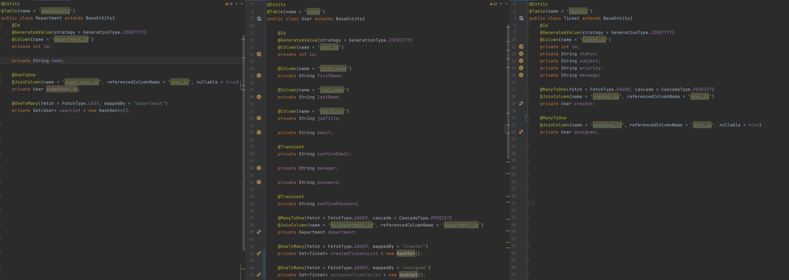
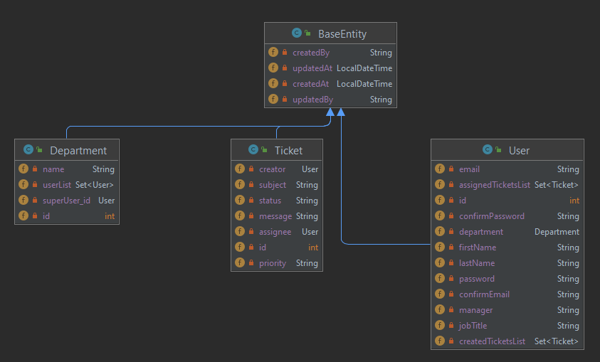
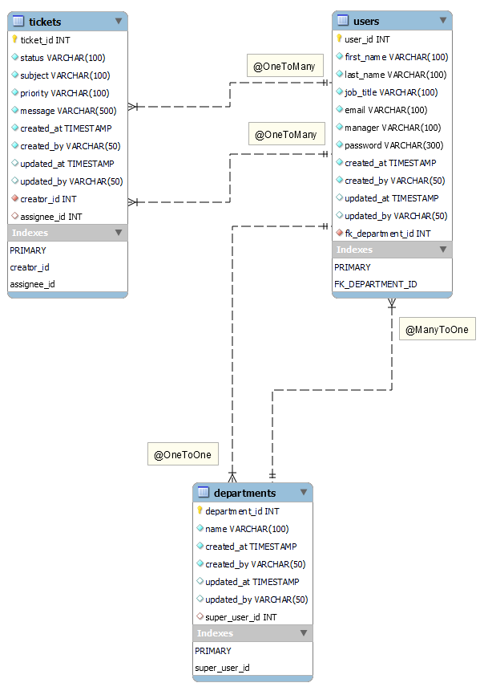

# 1. Map Java classes to DB tables

## 1.1. Add necessary dependency

```
<dependency>
    <groupId>org.springframework.boot</groupId>
    <artifactId>spring-boot-starter-data-jpa</artifactId>
</dependency>
```

Briefly, Spring Data JPA is an **abstraction layer on the top of Hibernate** (JPA provider by default).
It immensely **reduces** the amount of boiler plate code needed to interact with a Database.

## 1.2 Annotate the Entities previously created and define the required mappings



## 1.3 Entity and Database Diagrams





## 1.4 Brief explanation about the mappings

- **@OneToMany** (user > tickets)

  - User A can be the creator / assignee of MANY tickets
  - One ticket, can only have ONE user as creator / assignee

- **@ManyToOne** (user > departments)

  - User A can be part of only ONE department
  - The department IT will have MANY users

- **@OneToOne** (departments > user)

  - The department IT will have ONE superuser
