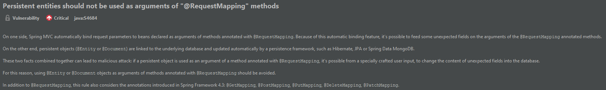

# 1. DTO

To address this vulnerability:

- I'm going to create an UserDTO class that will contain the necessary fields required by the user, in this case, to register.

  - This class **won't** be a persistent object (won't be annotated with @Entity)

- Create an Object of this Class and add it has an attribute to the Model

- Retrieve it on the @Controller from the HTML form

- Convert the DTO to the @Entity annotated POJO using the ModelMapper Library (so we don't need to do it manually).

- Call the Service layer service using the converted POJO as argument
